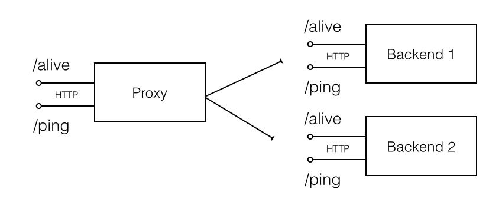

# HTTP proxy exercise

This is an interview task we use for exploring the programming capabilities. Please design and implement a simple HTTP proxy regarding to the following requirements.

* The proxy is supposed to listening on ```localhost``` and the port ```8080```. 
* There are two identical backends represented by HTTP servers
 * Backend 1 listens on ```localhost``` and the port ```8081```
 * Backend 2 listens on ```localhost``` and the port ```8082```
* A backend server handles two resource on on the URI ```/alive``` and ```/ping```
 * a GET HTTP request on the path ```/alive``` returns a JSON document ```{"backend":{"id": "%ID"}}```
 * a GET HTTP request on the path ```/ping``` returns ```pong```



## List backends

The proxy handles a GET HTTP request on ```/backends``` by dispatching GET ```/alive``` requests to both backends, merges their responses and returns a JSON document with the following structure

```
{  
  "backends":[  
    {  
      "backend":{  
        "id":"%ID"
      }
    },
    {  
      "backend":{  
        "id":"%ID"
      }
    }
  ]
}
```

## Ping HTTP requests proxying

The proxy handles a GET HTTP request on the path ```/ping``` by dispatching the request to one of the backends and returning its response. A HTTP proxy client may choose the preferred backend via the HTTP header ```X-Backend-id:%ID```.

* A backend might be temporary unavailable and immediately respond with HTTP status 503. When a backend returns 503 the proxy will dispatch the request to another backend.
* A backend might be slowed down and respond after a while.  When a backend doesn't respond in 5 seconds the proxy will dispatch the request to another backend. When both backends do not respond the proxy will respond by HTTP status 503.

## Implementation notes

Please fork this GitHub repository and send a pull request once the acceptance test ```com.gooddata.interviewtask.httpproxy.AcceptanceTest``` passed (```mvn test```). The test starts mocked HTTP servers simulating behaviour of the real backends. It's highly recommended to use the test while you develop the proxy. Feel free to use your favourite Java server technology, MVC framework or HTTP client.
